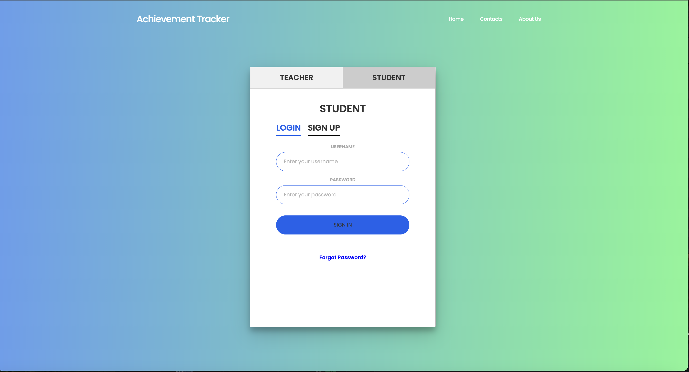
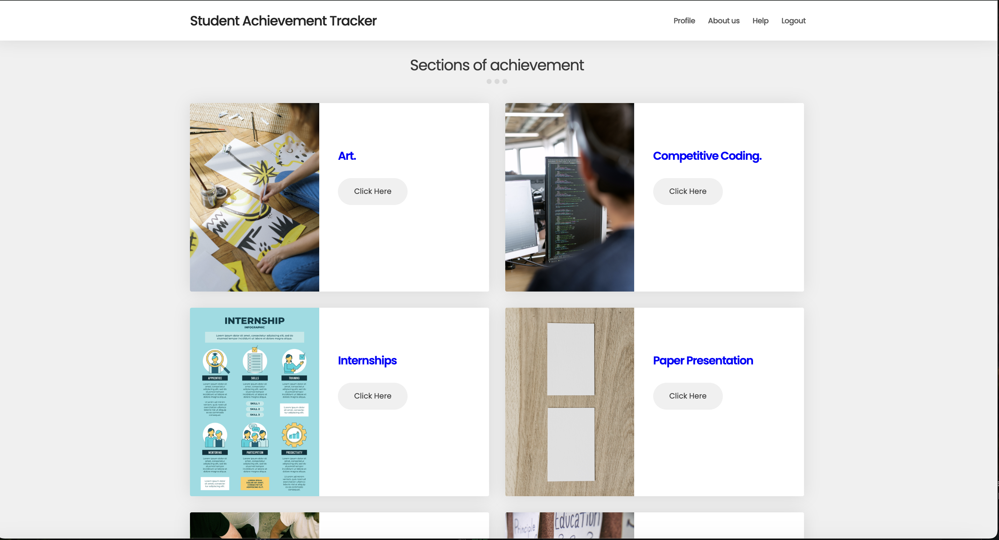
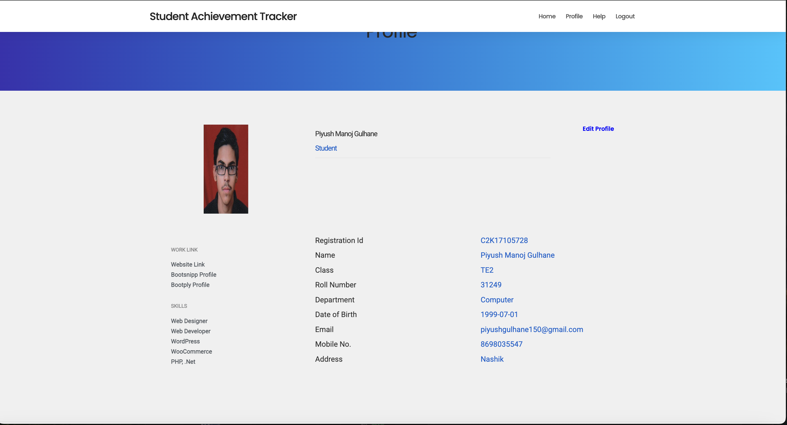
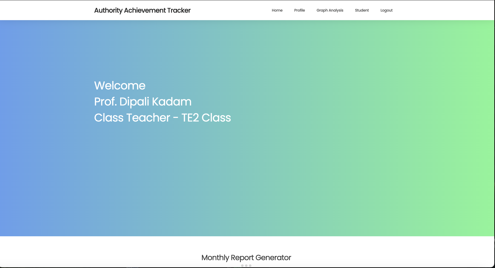
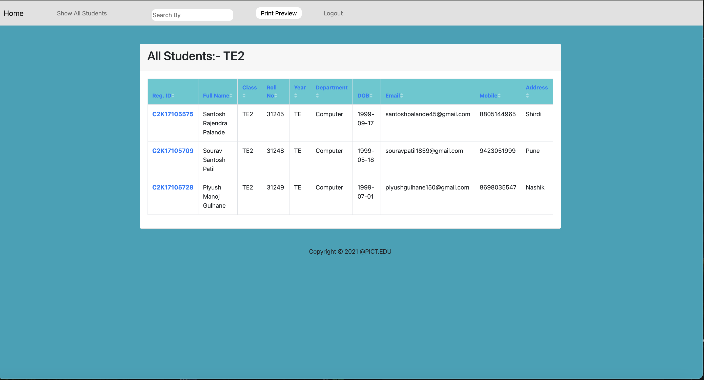
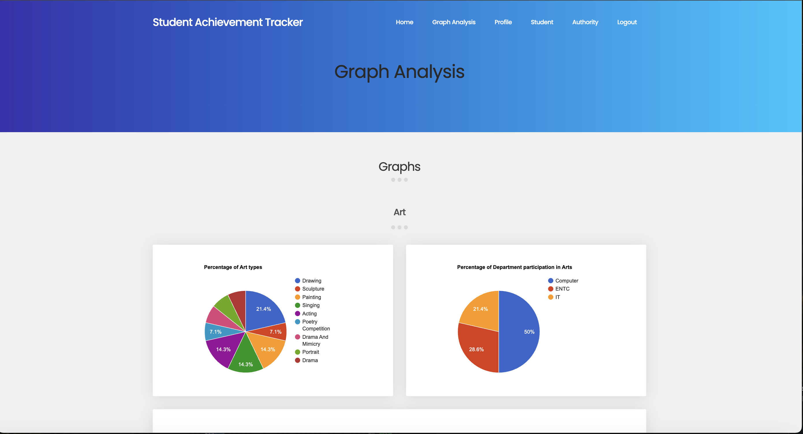
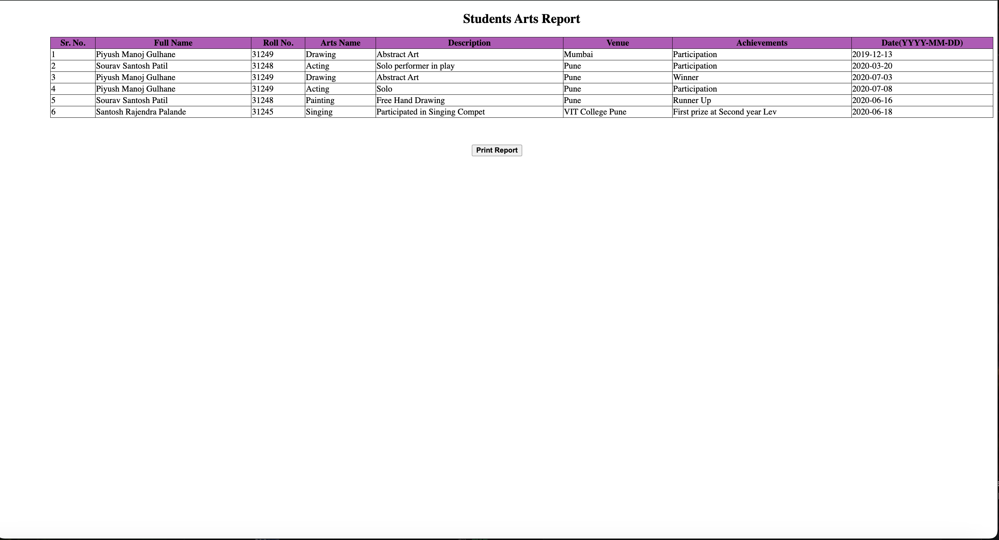

# Student Engagement Tracker

**A comprehensive dashboard application for tracking and managing student achievements beyond academics.**

---

##  Overview

**Student Engagement Tracker** is a web-based application designed to provide a centralized platform for students, teachers, and administrators to log, monitor, and assess extracurricular and co-curricular achievements.

The system ensures that non-academic accomplishments such as participation in arts, sports, research, coding competitions, internships, social work, and paper presentations are systematically documented and reviewed.

---

##  Key Features

###  For Students

- Submit achievements across various non-academic categories:
  - Arts
  - Sports
  - Research
  - Coding Competitions
  - Internships
  - Social Work
  - Paper Presentations
- Fill out category-specific forms to log each entry.
- Upload supporting documents or proofs for each submission.
- Edit or delete existing entries.
- View a summarized profile displaying their accomplishments across categories.

> 📸 _Placeholder: Add a screenshot of the student dashboard here._

---

### For Teachers

- Personalized dashboard to view and manage data for their assigned classes.
- View and verify student-submitted achievements.
- Download proof documents for review and validation.
- Approve student leave requests or other submission-based permissions.
- Access-based viewing: each teacher can see data relevant to their students only.
- Add their own achievements using one of the 20 tailored forms designed for routine academic or administrative tasks.
- Generate reports from filtered data and print or export the visible records.
- Visualize student performance and activity summaries using graphical views.

> 📸 _Placeholder: Add a screenshot of the teacher dashboard with report generation and graph features._

---

### 🛠️ For Administrators

- Full-access administrative panel with the ability to:
  - Assign teachers to specific classes.
  - Assign groups of students to professors as mentors.
  - Add, edit, or delete records from both student and teacher accounts.
  - Oversee the entire ecosystem of data entry and management.
- Manage teacher workloads, data access rights, and institutional reports.

> 📸 _Placeholder: Add a screenshot of the admin dashboard with user and data management features._

---

## Tech Stack

# Example
Frontend: HTML+CSS+ Javascript
Backend: PHP
Database: MySQL  
