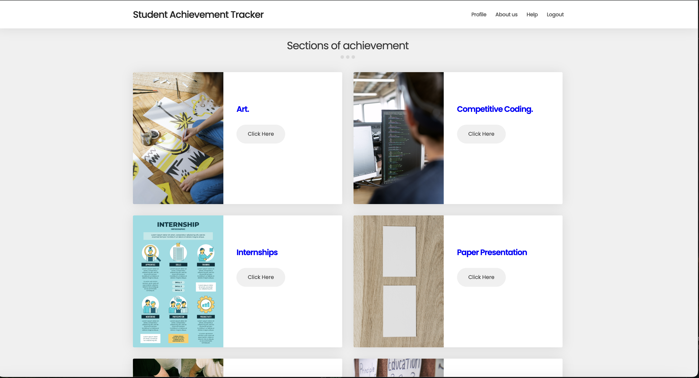
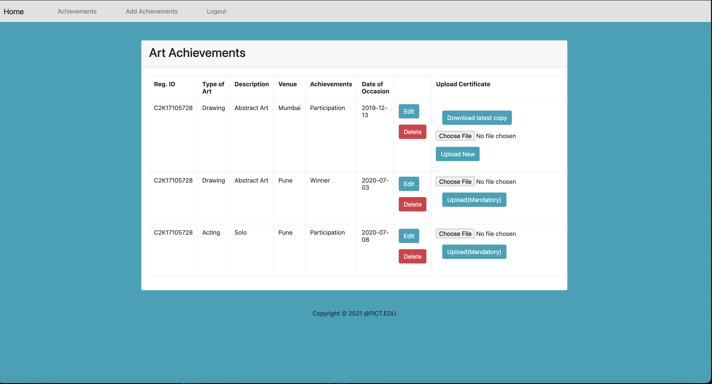
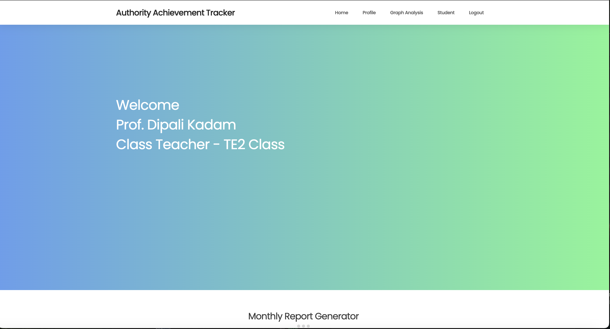
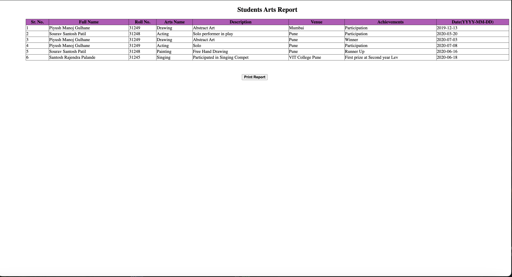
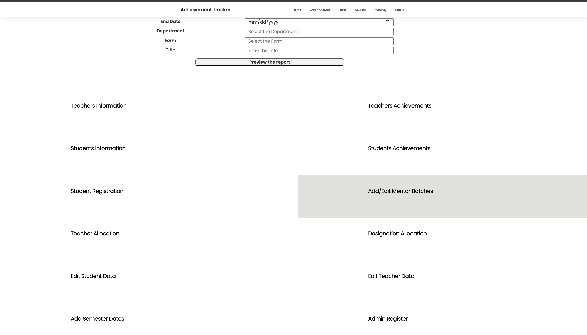

# Student Engagement Tracker

**A comprehensive dashboard application for tracking and managing student achievements beyond academics.**

---

##  Overview

**Student Engagement Tracker** is a web-based application designed to provide a centralized platform for students, teachers, and administrators to log, monitor, and assess extracurricular and co-curricular achievements.

The system ensures that non-academic accomplishments such as participation in arts, sports, research, coding competitions, internships, social work, and paper presentations are systematically documented and reviewed.

The Application was in use at **Pune Institute of computer technology,Pune**  between 2021 to 2024 for College students.

The Demo videos for the working of this application are uploaded to Youtube, follow these links to check them.

Student dashboard : https://youtu.be/ev9uaFPWh_s

Teacher dashboard : https://youtu.be/AGuelbCo31k

Admin Dashboard : https://youtu.be/Ahfi-iObx8A
---

##  Key Features

###  For Students

- Submit achievements across various non-academic categories:
  - Arts
  - Sports
  - Research
  - Coding Competitions
  - Internships
  - Social Work
  - Paper Presentations
- Fill out category-specific forms to log each entry.
- Upload supporting documents or proofs for each submission.
- Edit or delete existing entries.
- View a summarized profile displaying their accomplishments across categories.

Login Screen

Students Dashboard to select from multiple options

Adding/Editing Details & uploading proof image Screen

Students Profile

---

### For Teachers

- Personalized dashboard to view and manage data for their assigned classes.
- View and verify student-submitted achievements.
- Download proof documents for review and validation.
- Approve student leave requests or other submission-based permissions.
- Access-based viewing: each teacher can see data relevant to their students only.
- Add their own achievements using one of the 20 tailored forms designed for routine academic or administrative tasks.
- Generate reports from filtered data and print or export the visible records.
- Visualize student performance and activity summaries using graphical views.

Teachers DashBoards view

Tablular view of students achievements

Graphical summary of class student activities

Preview to print the desired data after filtering

---

### 🛠️ For Administrators

- Full-access administrative panel with the ability to:
  - Assign teachers to specific classes.
  - Assign groups of students to professors as mentors.
  - Add, edit, or delete records from both student and teacher accounts.
  - Oversee the entire ecosystem of data entry and management.
- Manage teacher workloads, data access rights, and institutional reports.

Admin Actions

---

## Tech Stack

Frontend: HTML+CSS+ Javascript
Backend: PHP
Database: MySQL  
